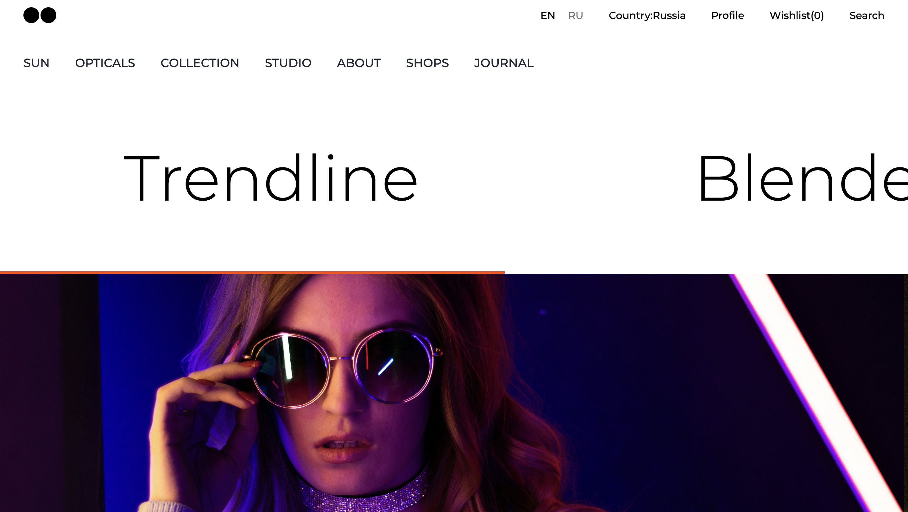

# CSS Project 3    

This project demonstrates a responsive, user-friendly interface using HTML and CSS. The focus is on dynamic content, cross-browser compatibility, and structured workflows, making it ideal for beginners and collaborative front-end development.

## Table of Contents
•⁠  ⁠[Project Overview](#project-overview)
•⁠  ⁠[Technologies Used](#technologies-used)
•⁠  ⁠[Setup](#setup)
•⁠  ⁠[Features](#features)
•⁠  ⁠[Usage](#usage)
•⁠  ⁠[Contributing](#contributing)
•⁠  ⁠[License](#license)

## Project Overview
This project showcases a responsive, user-friendly interface emphasizing dynamic content, cross-browser compatibility, and structured workflows. It includes a navigation bar, main content area with text and images, and uses Google Fonts for styling.

## Technologies Used
•⁠  ⁠HTML5
•⁠  ⁠CSS3
•⁠  ⁠Google Fonts

## Setup
1.⁠ ⁠Clone the repository:
    ⁠ bash
    git clone https://github.com/kaakanksha2310/CSS-Project-3.git
     ⁠
2.⁠ ⁠Navigate to the project directory:
    ⁠ bash
    cd your-repository
     ⁠
3.⁠ ⁠Open the ⁠ index.html ⁠ file in your preferred web browser.

## Features
•⁠  ⁠*Responsive Navigation Bar*: The navigation bar includes language selection, country display, profile link, wishlist count, and search option.
•⁠  ⁠*Secondary Navigation Bar*: Contains links to different sections such as Sun, Opticals, Collection, Studio, About, Shops, and Journal.
•⁠  ⁠*Content Area*: Displays dynamic text and images with a structured layout.

## Usage
1.⁠ ⁠Open the project in your browser.
2.⁠ ⁠Explore the navigation bar and content sections.
3.⁠ ⁠Customize the text and images in the ⁠ index.html ⁠ file to suit your needs.

## Contributing
Contributions are welcome! Please fork the repository and create a pull request with your changes.

## License
This project is licensed under the MIT License - see the [LICENSE](LICENSE) file for details.

## Acknowledgements
•⁠  ⁠[Google Fonts](https://fonts.google.com/) for providing the Montserrat font used in this project.

---

This project was created to demonstrate basic HTML and CSS skills and is a great starting point for beginners and collaborative front-end development.